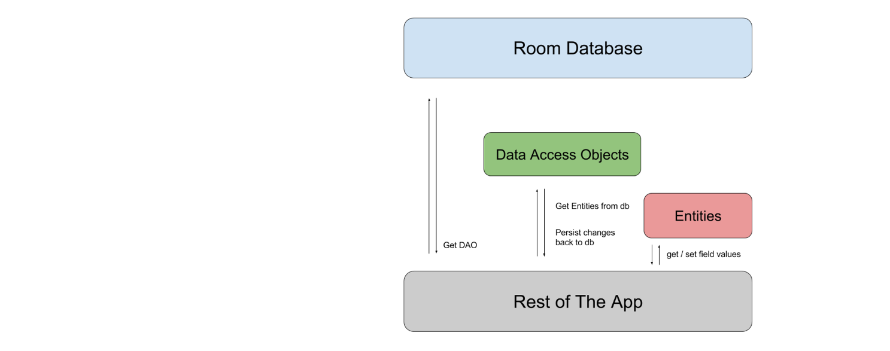

#### Room
<span style="color:gray">android.arch.persistence.room</span>
<br>
<span style="color:gray; font-size:0.5em;">13-10-2017</span>

---

### <span style="color: #00B8D4; text-transform: none">Room</span> <span style="text-transform: none">goal</span>
<br>

* No boilerplate: SQL queries / Java data objects
* Compile-time verification

---

### <span style="color: #00B8D4; text-transform: none">Room</span> <span style="text-transform: none">components</span>
<br>

* Database
* Entity
* Data Access Objects

---

### <span style="color: #00B8D4; text-transform: none">Database</span>
<br>

```kotlin
@Database(entities = arrayOf(ExampleEntity::class), version = 1)
abstract class ExampleDatabase : RoomDatabase() {

    abstract fun exampleDao(): ExampleDao
}
```

<span style="color:gray; font-size:0.6em;">ExampleDatabase.kt</span>

---

### <span style="color: #00B8D4; text-transform: none">Entity</span>
<br>

```kotlin
@Entity(tableName = "example")
class Example(

    @PrimaryKey
    val id: String,
    
    @ColumnInfo(name = "name") // Optional
    val name: String,
    
    @Ignore
    val picture: Bitmap)
```

<span style="color:gray; font-size:0.6em;">Example.kt</span>

---

### <span style="color: #00B8D4; text-transform: none">DAO</span>
<br>

```kotlin
@Dao
interface ExampleDao {

    @Insert(onConflict = OnConflictStrategy.REPLACE)
    fun save(example: Example)

    @Query("SELECT * FROM example ORDER BY name DESC")
    fun load(): List<Example>

    @Query("DELETE FROM example")
    fun clearAll()
}
```

<span style="color:gray; font-size:0.6em;">ExampleDao.kt</span>

---

### Demo

<span style="color:gray; font-size:0.5em;">Source: developer.android.com/topic/libraries/architecture/room.html</span>
</br>
<span style="color:gray; font-size:0.5em;">Pres Source: github.com/Mercandj/tracker-android</span>
